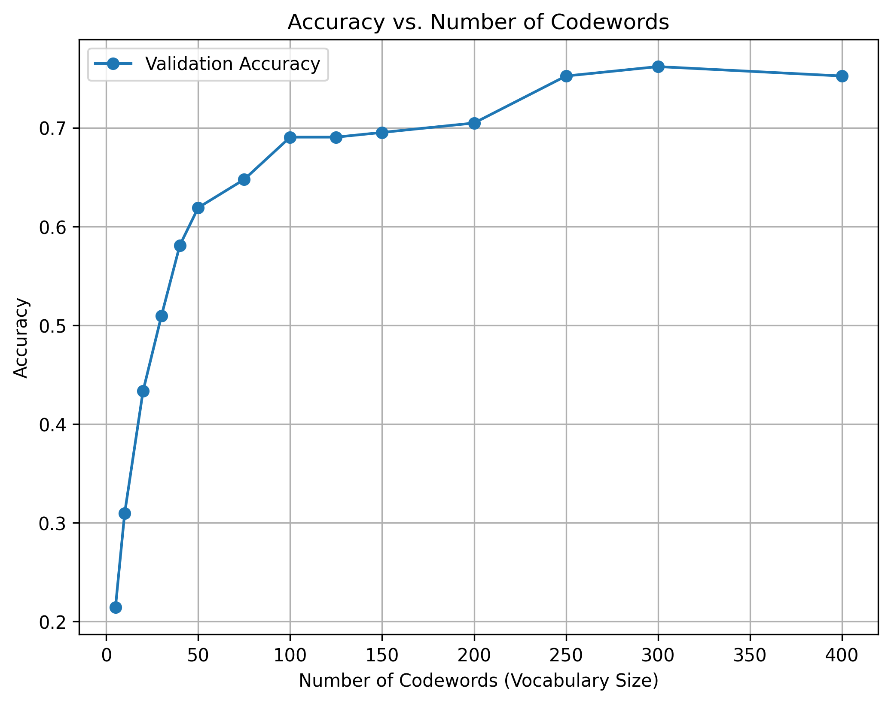
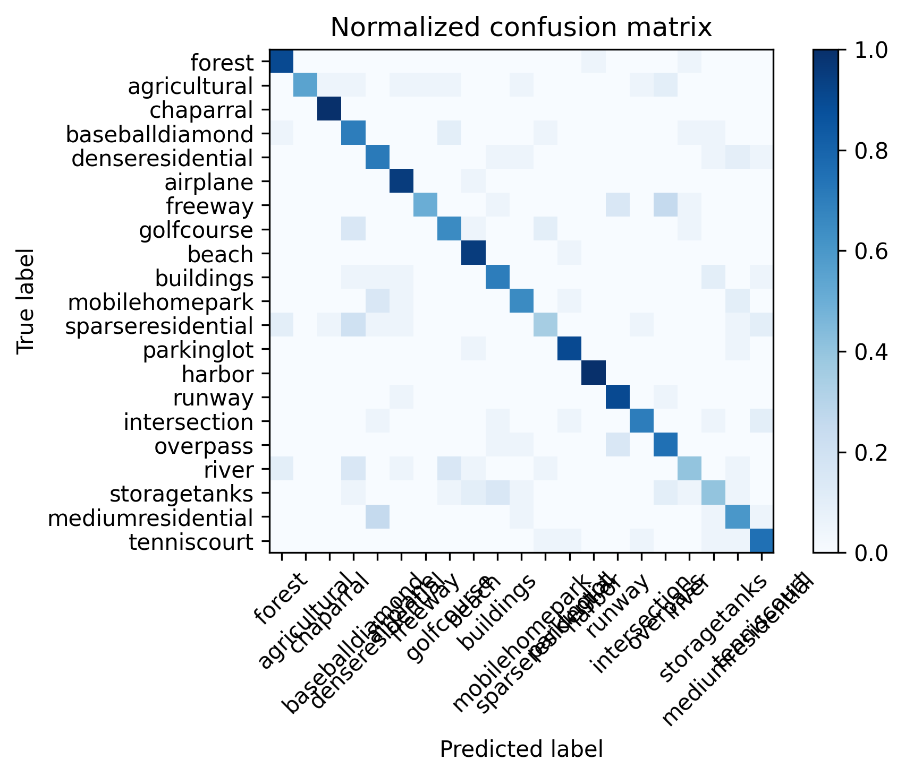

# GNR 638 Assignment 1

**Done by:**

- Aditya Anand (21D070007)
- Shounak Das (21D070068)


This repository contains the solution for Assignment 1 of the GNR 638 course.

## How to Run

1. Clone this repo:
   ```bash
   git clone https://github.com/shounakd56/GNR638_Assignment_1.git
   ```
2. Run the main script:
   ```bash
   python code/main.py
   ```
3. For tsne plots, run:
   ```bash
   python code/plot_tsne.py
   ```
The output plots are saved in the results folder.
All the computed vocabularies and features have been saved a pickle files in the pickle_files folder, to save time by directly using them once they have been computed for the first time.
We used random seed to ensure reproducible splits everytime.

In the build_vocabulary function, we grayscaled the images to ensure 2D images for SIFT computation.

In the get_bags_of_sifts we modified it such that it can use vocabs from .pkl files if they are already saved to save time and computation.

in the svm_classify function, we changed C from 700 to 100 as it was giving better accuracies due to less penalty.

In the nearest_neighbor_classify function, we added the categories of our new dataset in the given code.

Install dependencies using:

```bash
conda install -c conda-forge cyvlfeat
pip install scikit-learn matplotlib opencv-python ipykernel
```

## Results

### Accuracy vs. Vocabulary Size:



- Codebook Size 5: Validation Accuracy = 0.2143
- Codebook Size 10: Validation Accuracy = 0.3095
- Codebook Size 20: Validation Accuracy = 0.4333
- Codebook Size 30: Validation Accuracy = 0.5095
- Codebook Size 40: Validation Accuracy = 0.5810
- Codebook Size 50: Validation Accuracy = 0.6190
- Codebook Size 75: Validation Accuracy = 0.6476
- Codebook Size 100: Validation Accuracy = 0.6905
- Codebook Size 125: Validation Accuracy = 0.6905
- Codebook Size 150: Validation Accuracy = 0.6952
- Codebook Size 200: Validation Accuracy = 0.7048
- Codebook Size 250: Validation Accuracy = 0.7524
- Codebook Size 300: Validation Accuracy = 0.7619
- Codebook Size 400: Validation Accuracy = 0.7524

 ###  Best Vocabulary Size: 300
 ###  Validation Accuracy (Best): 0.7619
 ###  Test Accuracy using SVC: 0.7149643705463183
 ###  Test Accuracy using KNN: 0.7125890736342043


  ### Class-wise Accuracy:
                      precision    recall  f1-score   support
   
              forest     1.0000    0.5500    0.7097        20
        agricultural     0.7600    0.9500    0.8444        20
           chaparral     0.5185    0.7000    0.5957        20
     baseballdiamond     0.7600    0.9500    0.8444        20
    denseresidential     0.6667    0.7000    0.6829        20
            airplane     0.9091    1.0000    0.9524        20
             freeway     0.5769    0.7143    0.6383        21
          golfcourse     0.7826    0.9000    0.8372        20
               beach     0.9091    0.5000    0.6452        20
           buildings     0.6500    0.6500    0.6500        20
      mobilehomepark     0.9524    1.0000    0.9756        20
    sparseresidential    0.8235    0.7000    0.7568        20
          parkinglot     0.5714    0.6000    0.5854        20
              harbor     0.7222    0.6500    0.6842        20
              runway     0.6000    0.7500    0.6667        20
        intersection     0.8182    0.9000    0.8571        20
            overpass     0.6154    0.4000    0.4848        20
               river     0.7500    0.9000    0.8182        20
        storagetanks     0.5833    0.3500    0.4375        20
    mediumresidential    0.5333    0.4000    0.4571        20
         tenniscourt     0.6818    0.7500    0.7143        20

             accuracy                         0.7150       421
            macro avg     0.7231    0.7150    0.7066       421
         weighted avg     0.7227    0.7150    0.7064       421


